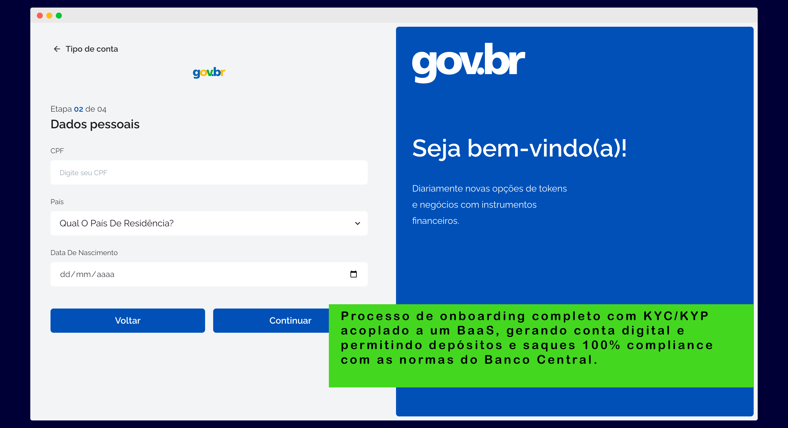
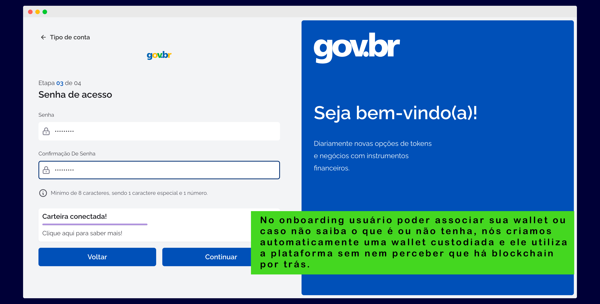
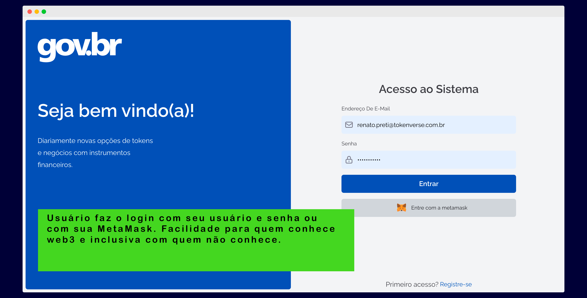
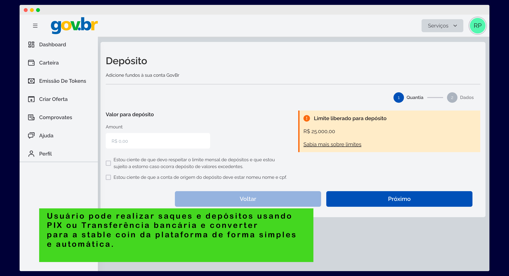
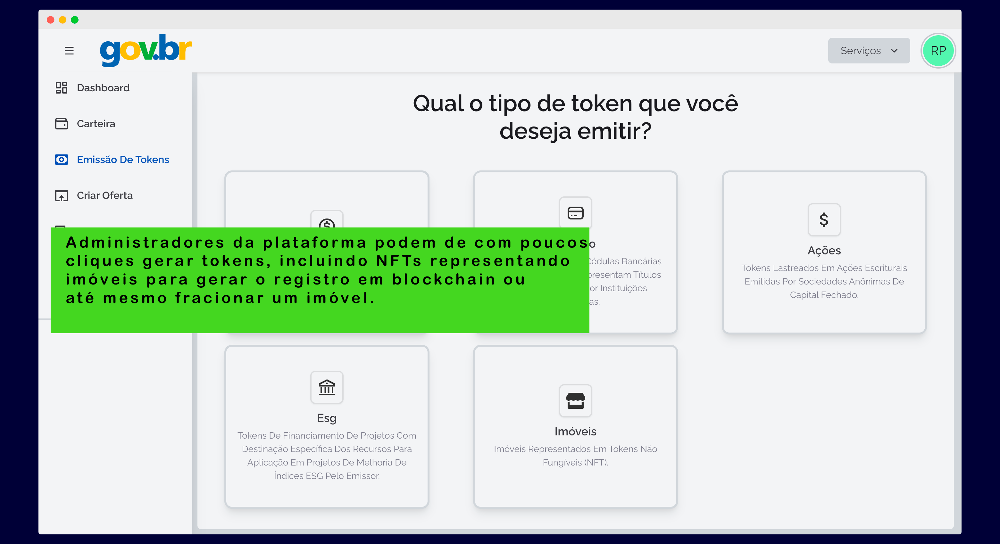

<h1 align="center">
    
</h1>

<h2 align="center">

</h2>

<h1 align="center">Plataforma online de imóveis públicos</h1>

## Index

- [Index](#index)
- [Sobre o projeto](#sobre-o-projeto)
- [Features](#features)
- [Tecnologias utilizadas](#tecnologias-utilizadas)
- [Telas](#telas)
- [Equipe](#equipe)
- [Licença](#licença)

## Sobre o projeto

<h4>Nosso projeto apresenta melhorias e inspirações para uma forma mais transparente, rápida e eficiente de destinação dos imóveis da União, como venda, cessão e outros. Além disso, focamos em ser inclusivos, com o objetivo de alcançar a população em geral, com a funcionalidade de permitir cadastro e login com ou sem wallet instalada. Para aqueles que não tem wallet ou sequer sabem o que ela é, a plataforma cria uma wallet custodiada sem que o usuário perceba. Isso permite que as pessoas usufruam da tecnologia blockchain de forma orgânica, transparente e simplificada.</h4>

## Features

Entendemos que, com as destinações dos imóveis sendo feitas em blockchain, conseguiríamos trazer os seguintes benefícios para a União e para a população em geral: 

- Transações com DvP e liquidação atômica: Com o pagamento feito em stable coins e com recebimento automático do NFT que representa o imóvel,  trazemos simplificação e segurança para as transações, ao mesmo tempo que permitimos o registro dessas transações de forma pública e imutável, gerando transparência para as partes interessadas. Além disso, o sistema já estaria preparado para uso do Real Digital (CBDC), em processo de criação pelo Banco Central do Brasil.

- Registro e informações publicas de destinações: As destinações feitas através de vendas, cessões, doações, etc. , hoje, além de complexas para a SPU, não são transparentes para a população. Com o registro em blockchain e com as informações exibidas em um portal, além de aumento de eficiência e possibilitar melhor gestão do patrimônio público, traria transparência e permitiria, por exemplo, que um cidadão pesquisasse os imóveis da União que existem na cidade em que reside de forma rápida e, com isso, entender todo o histórico de uso e destinação do bem público.

## Tecnologias utilizadas

<h4>Smart contracts escritos em Solidity e uma plataforma proprietária de criação de nossa empresa (Tokenverse). Como evolução do projeto, recomendamos fortemente a adoção de tokens permissionados, que restringem sua transferência apenas a wallets que já tenham feito KYC/KYP, e que possam ser bloqueados/transferidos pelo administrador da plataforma.</h4>

- Frontend escrito em ReactJS
  - NextJS
  - ChakraUI
  - ReactQuery
  - Ethers
  - Metamask
  - AWS Amplify
- Backend escrito em NestJS
  - Prisma
  - Ethers
  - AWS s3, ECS, RDS com PostgreSQL
- Blockchain CELO
  - Alfajores Testnet

## Telas

* Onboarding

* Login com email e senha ou Metamask

* Depósito

* Criação de token

---

## Equipe

<table>
  <tbody>
    <tr>
      <td align="center" valign="top" width="14.28%"><a href="https://github.com/velantic"> <b>Renato Preti</b></a> </td>
      <td align="center" valign="top" width="14.28%"><a href="https://github.com/andersonsvinnvo"> <b>Anderson Vieira</b></a> </td>
      <td align="center" valign="top" width="14.28%"><a href="https://www.linkedin.com/in/paulo-reis7"> <b>Paulo Reis</b></a> </td>
      <td align="center" valign="top" width="14.28%"><a href="https://github.com/ricardo-passos"> <b>Ricardo Passos</b></a> </td>
      <td align="center" valign="top" width="14.28%"><a href="https://filipemarques.dev/"> <b>Filipe Marques</b></a> </td>
    </tr>
  </tbody>
</table>

## Licença

Esse projeto utiliza a MIT license. Veja mais detalhes no link [LICENSE](LICENSE).
